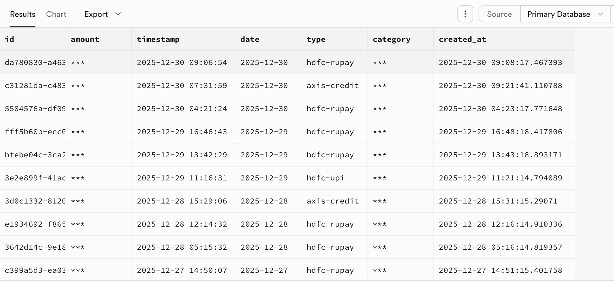

### README.md
Very simple

1. Follow [this](https://gist.github.com/amanjaiswalofficial/4be22ddadce5c0ef828502033da74a96) walkthrough

2. Setup Gmail Apps Script, Setup Supabase, Stitch things together and Deploy

3. This repo contains all the work done for building the perfect expense tracker

